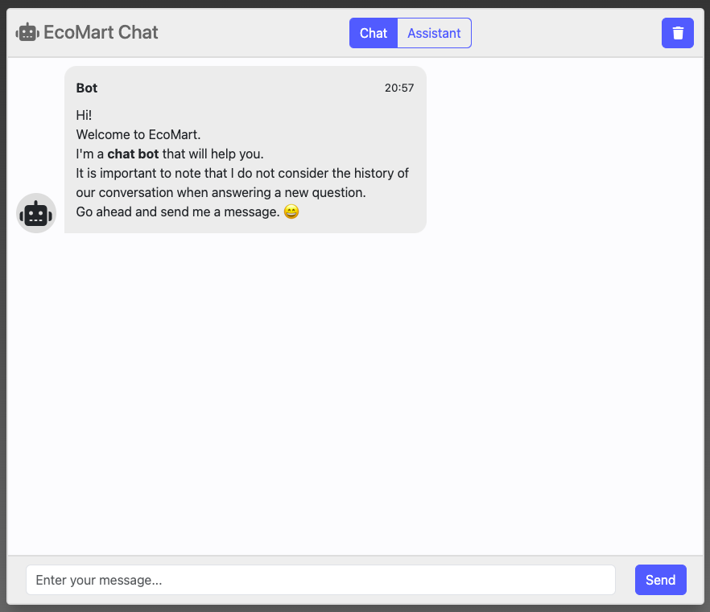
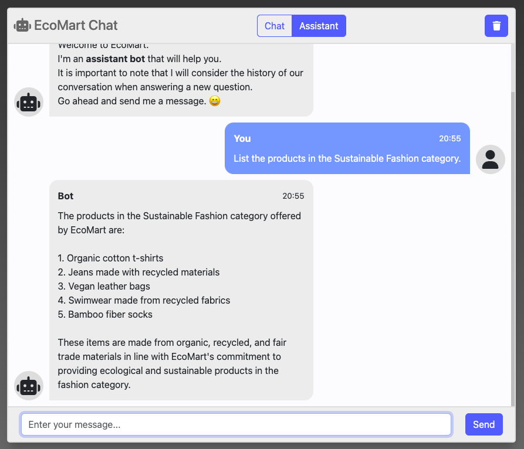
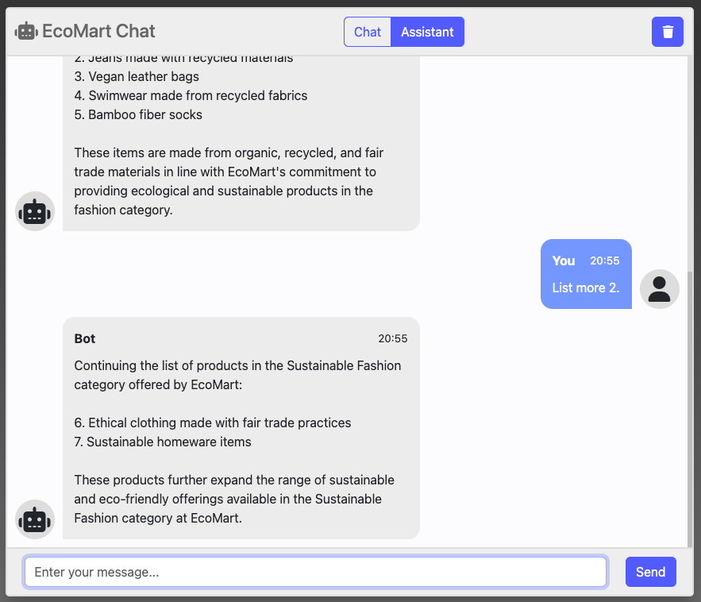

# OpenAI Python

OpenAI GPT integration project using Python.


## Features

This project provide the below features:
- `OpenAI Chat`
  - "Given a list of messages comprising a conversation, the model will return a response."
- `OpenAI Exception Handler`
  - Consider specific exception scenarios to handle it. 
- `Token Counter`
  - Counts how many tokens exist in the input, estimate the output tokens, and then select a proper model to use it.
- `Chatbot UI`
  - Frontend application in HTML, CSS and Javascript to interaction with the solution.
- `OpenAI Assistants`
  - "The Assistants API allows you to build AI assistants within your own applications. An Assistant has instructions and can leverage models, tools, and knowledge to respond to user queries."
  - Reference: https://platform.openai.com/docs/assistants/overview
- `Thread History`
  - Assistant will consider or not the previous conversation in the future responses.
- `Knowledge Retrieval`
  - "Retrieval augments the Assistant with knowledge from outside its model, such as proprietary product information or documents provided by your users. Once a file is uploaded and passed to the Assistant, OpenAI will automatically chunk your documents, index and store the embeddings, and implement vector search to retrieve relevant content to answer user queries."
  - Reference: https://platform.openai.com/docs/assistants/tools/knowledge-retrieval
- `Function Calling`
  - "Similar to the Chat Completions API, the Assistants API supports function calling. Function calling allows you to describe functions to the Assistants and have it intelligently return the functions that need to be called along with their arguments. The Assistants API will pause execution during a Run when it invokes functions, and you can supply the results of the function call back to continue the Run execution."
  - Reference: https://platform.openai.com/docs/assistants/tools/function-calling

## Installation

Download the project using the below GIT command:
```
$ git clone https://github.com/diogoaltoe/openai-python.git
```

### Activate the virtual environment (venv)

Using the Terminal, execute the command below.

On Windows:
```
.venv\Scripts\activate
```

On Unix or MacOS:
```
source .venv/bin/activate
```

### Install project dependencies

Use pip to install the project dependencies listed in the `requirements.txt` file:
```
pip install -r requirements.txt
```

### Publish static assets

To publish the static assets, execute the command below:
```
python manage.py collectstatic 
```


## Usage

### Environment Variables

Create inside root folder a `.env` file with the below variables:
```
SECRET_KEY=<your_django_key>
OPENAI_API_KEY=<your_openai_api_key>
OPENAI_API_ASSISTANT_ID=<your_openai_api_assistant_id>
```

### OpenAI API

To use `OpenAI API`, you need to:
- Go to OpenAI Platform Playground (https://platform.openai.com);
- In the left menu, click on `API keys` option;
- Click on `+ Create new secret key` button;
- Fill the `Name` field and click on `Create secret key` button;
- Copy the `key` and set the `OPENAI_API_KEY` environment variable inside the created `.env` file (see `Environment Variables`).

### OpenAI Assistants

To use `Assistants` feature, you need to:
- Go to OpenAI Platform Playground (https://platform.openai.com/playground);
- Select `Assistants` option;
- Create a new assistant;
- In `Name` field, give a proper name for it;
- In `Instructions` field, add these instructions:
```
You are an e-commerce customer service chatbot.
You should not answer questions that are not related to e-commerce!
```
- Copy the `Assistant ID` that is below to the `Name` field and set the `OPENAI_API_ASSISTANT_ID` environment variable inside the created `.env` file (see `Environment Variables`).

### Knowledge Retrieval

To work with `Retrieval` feature, you need to:
- Go to OpenAI Platform Playground (https://platform.openai.com/playground);
- Select `Assistants` option;
- In `TOOLS` option:
  - Enable `Retrieval`;
  - Upload the 2 files existing inside `chatbot/data` folder:
    - info.md
    - policy.md

### Functions Calling

To work with `Functions` feature, you need to:
- Go to OpenAI Platform Playground (https://platform.openai.com/playground);
- Select `Assistants` option;
- In `TOOLS` option:
  - In `Functions`, click in `+Function` button;
  - Open the `calculateShipping.json` file inside `chatbot/data`, copy the content and paste it in the function field;
  - Then, click on `Save` button;
  - It should save the new function and show below `Functions` the `calculateShipping` function name.

### Run Project

Run the project using the command below:
```
python manage.py runserver
```

Then access the application, clicking in the link: http://127.0.0.1:8000/

### Using EcoMart Chat

In the top bar of `EcoMart Chat`, in the center, you have the option of using the bot in `Chat` or `Assistant` mode.

Still at the top right, you have the option to clear the conversation history (`Trash` icon). If you are using the bot in `Assistant` mode, it will lose the past reference of the conversation.

In the bottom bar, you can enter your message and click the `Send` button to send the message.

#### Example Using in Chat Mode


#### Example Using in Assistant Mode


#### Example Using in Assistant Mode and Keeping the Historical Context



## Libraries

- [Django](https://www.djangoproject.com/)
- [python-dotenv](https://pypi.org/project/python-dotenv/)
- [OpenAI Python API library](https://pypi.org/project/openai/)
- [tiktoken](https://pypi.org/project/tiktoken/)
- [Font Awesome](https://fontawesome.com/)
- [Bootstrap](https://getbootstrap.com/)

For more all the libraries, check `requirements.txt` file.

## License

This project is licensed under the [MIT License](https://opensource.org/licenses/MIT).
